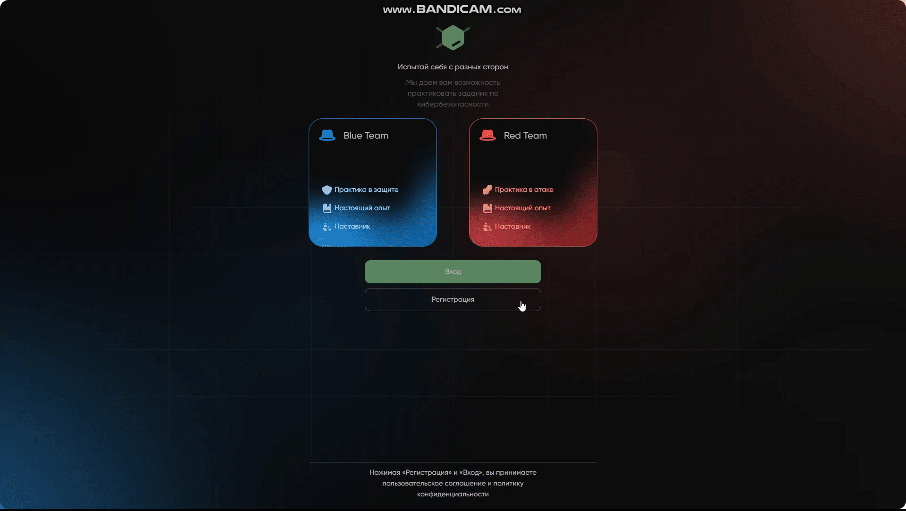

# CyberPlatform 🚀


<br/>



**CyberPlatform** — это современное высокопроизводительное веб-приложение для геймеров, построенное на стеке React/TypeScript с использованием передовых архитектурных паттернов. Проект находится в активной стадии разработки.


---

## 🏗 Architecture: Feature-Sliced Design (FSD)

Проект спроектирован с использованием методологии **FSD**, что обеспечивает строгую декомпозицию логики, высокую масштабируемость и легкость тестирования.

- **app**: Инициализация приложения (провайдеры, стили, роутинг).
- **pages**: Компоненты страниц, собирающие виджеты.
- **widgets**: Самостоятельные блоки страниц (например, Navbar, Sidebar).
- **features**: Части функциональности, несущие бизнес-ценность (авторизация, фильтрация).
- **entities**: Бизнес-сущности (User, Article, Profile) с их логикой.
- **shared**: Переиспользуемые UI-компоненты, хуки, API-клиенты и утилиты.

---

## 🛠 Tech Stack & Tools

### Core
- **React 19** & **TypeScript** (строгая типизация).
- **Redux Toolkit** — управление глобальным стейтом.
- **RTK Query** — эффективная работа с API, кэширование и нормализация данных.
- **React Router Dom 7** — декларативный роутинг.

### Infrastructure
- **Custom Webpack Config** — полная настройка сборки с нуля (не CRA/Vite).
- **Storybook** — изолированная разработка и документирование UI-компонентов.
- **Babel** — транспиляция и оптимизация кода.

### Quality & DX
- **ESLint (Airbnb config)** & **Stylelint** — соблюдение стандартов кода.
- **Jest & React Testing Library** — модульное и интеграционное тестирование.
- **React Hook Form + Zod** — безопасная и производительная работа с формами.

---

## 🧠 Challenges & Solutions

В процессе разработки я столкнулся с рядом технических вызовов, которые помогли мне глубже понять современный фронтенд:

1. **Освоение FSD**: Переход от обычной структуры папок к слоям и слайсам потребовал перестройки мышления. Основной сложностью было избегание циклических зависимостей и правильное распределение логики между `features` и `entities`. Решил это через строгий контроль импортов и использование `Public API` (index.ts) для каждого слайса.
2. **Конфигурация Webpack**: Отказ от готовых решений (Vite/CRA) в пользу ручной настройки Webpack позволил гибко настроить сборку (HMR, обработка CSS-модулей, минификация), но потребовал глубокого изучения плагинов и лоадеров.
3. **Оптимизация RTK Query**: Настройка базовых запросов с автоматическим обновлением токенов и кэшированием данных потребовала работы с `baseQuery` и перехватчиками (interceptors).
4. **Тестирование сложной логики**: Интеграция Jest с TypeScript и FSD-структурой потребовала настройки маппинга путей (`moduleNameMapper`) в конфиге Jest, чтобы тесты "видели" абсолютные импорты.

---

## 🚀 Getting Started

### 1. Клонирование репозитория
```bash
git clone https://github.com/Broker2007/cyberplatform-main.git
cd cyberplatform-main/frontend
```

### 2. Установка зависимостей
```bash
npm install
```

### 3. Запуск в режиме разработки
```bash
# Запуск фронтенда
npm start

# Запуск Mock-сервера (json-server)
npm run start:dev:server
```

### 4. Сборка проекта
```bash
# Production build
npm run build:prod
```

---

## 🧪 Testing & Documentation

- **Unit-тесты:** `npm run test:unit`
- **Storybook:** `npm run storybook` — запуск документации компонентов на порту 6006.

---

## 📈 Roadmap & Project Status

Проект находится в активной разработке. Текущие приоритеты:
- [ ] Завершение миграции всех сущностей на RTK Query.
- [ ] Расширение покрытия Unit-тестами до 80%.
- [ ] Внедрение виртуализации списков для больших объемов данных.
- [ ] Оптимизация SEO и доступности (A11y).

---

## 📬 Contact
**Fedor (Frontend Developer)**  
[GitHub](https://github.com/Broker2007) | [HH.ru Resume](https://spb.hh.ru/resume/83126af2ff0dbdd7e70039ed1f344a4d6b526b)
